

  
   
  

 
 

| 메인 피드 | 도안 공유 | 뜨개 지도 |
|---|---|---|
| 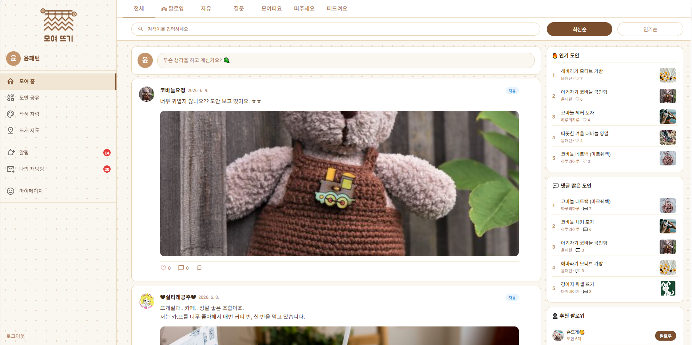 | 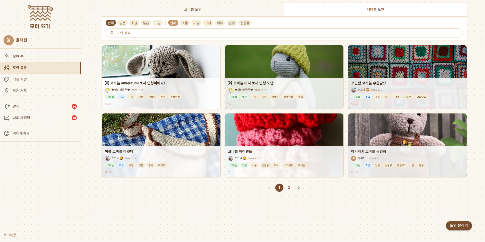 | 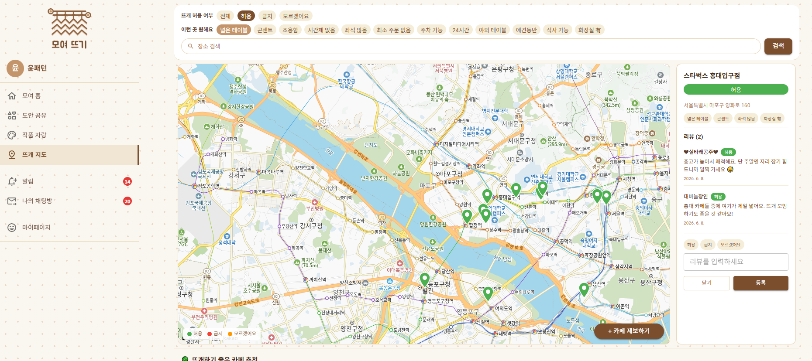 |

> 뜨개인을 위한 카페·도안 커뮤니티 플랫폼

## 목차
- [프로젝트 소개](#-프로젝트-소개)
- [개발 기간](#-개발-기간)
- [사용 기술](#-사용-기술)
- [주요 기능](#-주요-기능)
- [PPT](#-ppt)
- [시연 영상](#-시연-영상)
- [프로젝트 자료 모음](#-프로젝트-자료-모음)

 

## 📌 프로젝트 소개

> 뜨개질 관련 정보(카페 허용 여부, 도안 공유 등)가 인스타그램 등 일반 SNS에 산재해 있어
뜨개인 특화 플랫폼의 필요성을 느껴 기획한 React 개인 프로젝트입니다.

> **뜨개질 가능한 카페를 지도로 찾고, 도안을 공유하고, 뜨개인들과 소통할 수 있는 커뮤니티 플랫폼**이에요.

 

## 📅 개발 기간

| 기간 | 내용 |
|---|---|
| 2026.05.28 ~ 2026.06.09 | 기획 ~ 개발 완료 |
| 총 약 9일 | 실 작업 시간 약 55시간 |

 

## 🛠 사용 기술

### Frontend

- **React**: 컴포넌트 기반 UI 개발, useState/useEffect 훅 활용
- **Vite**: 빠른 개발 서버 및 빌드 도구
- **CSS Modules**: 컴포넌트 단위 스타일 관리, 클래스명 충돌 방지
- **MUI**: 공통 UI 컴포넌트 활용 (Tabs, Chip, Avatar 등)

### Backend

- **Node.js / Express**: REST API 서버 구현, 라우터 모듈화
- **JWT**: 로그인 인증 및 토큰 기반 사용자 식별
- **Socket.io**: 실시간 그룹 채팅 및 1:1 DM 구현
- **Multer / Sharp**: 이미지 업로드 및 리사이징 처리

### Database

- **Oracle DB 21c XE**: 16개 테이블 설계 및 운영, 시퀀스/제약조건 활용

### Tools & API

- **Git / GitHub**: 버전 관리 및 소스코드 공유
- **Figma**: 와이어프레임 및 화면 설계
- **카카오맵 API**: 지도 렌더링, 마커 표시, 장소 검색 연동

 

## ✨ 주요 기능

### 🗺 뜨개 지도
- 카카오맵 API 연동, 카페 마커 표시
- 허용/금지/모르겠어요 상태별 색상 구분
- 장소 검색 및 필터 기능
- 리뷰 작성 기능
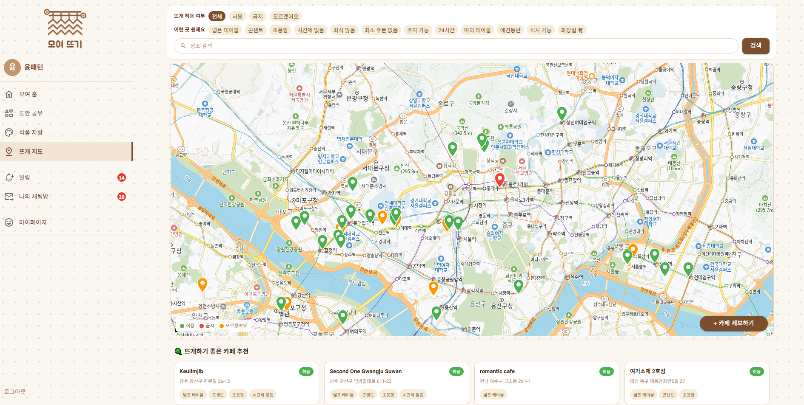

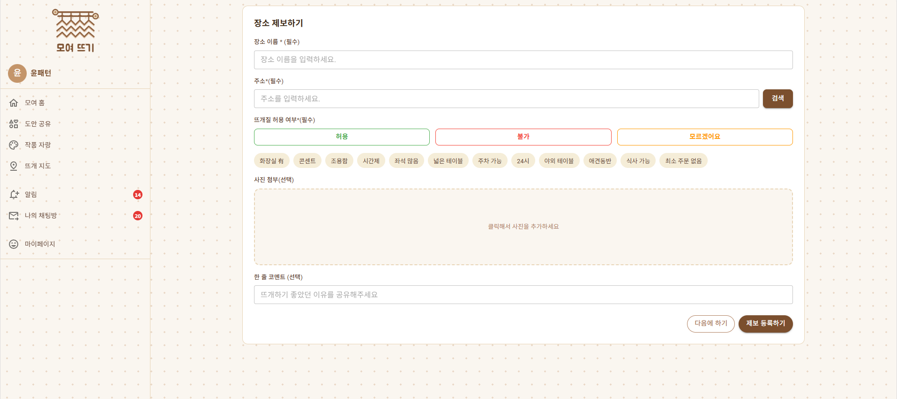

### 🧵 도안 공유
- 도안 목록 (코바늘/대바늘 탭, 난이도/태그 필터)
- 멀티 이미지 업로드 (Sharp 리사이징)
- 좋아요 / 스크랩 / 댓글·대댓글

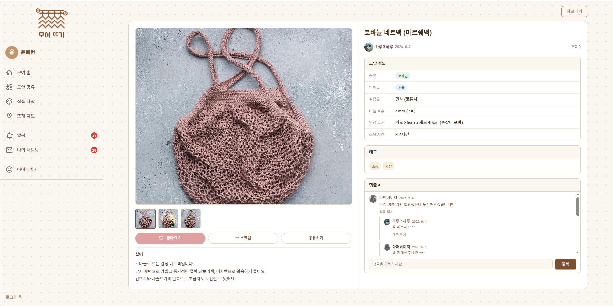
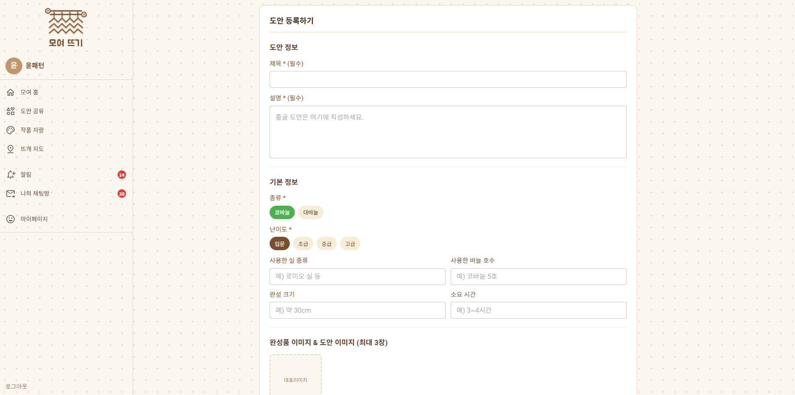

### 📋 커뮤니티 피드
- 트위터식 SNS 피드 (자유/질문/모여떠요/떠주세요/떠드려요)
- 인라인 게시글 작성 (이미지 최대 3장)
- 팔로잉 피드 탭 (내가 팔로우한 사람 게시글만)
- 좋아요 / 스크랩 / 댓글·대댓글

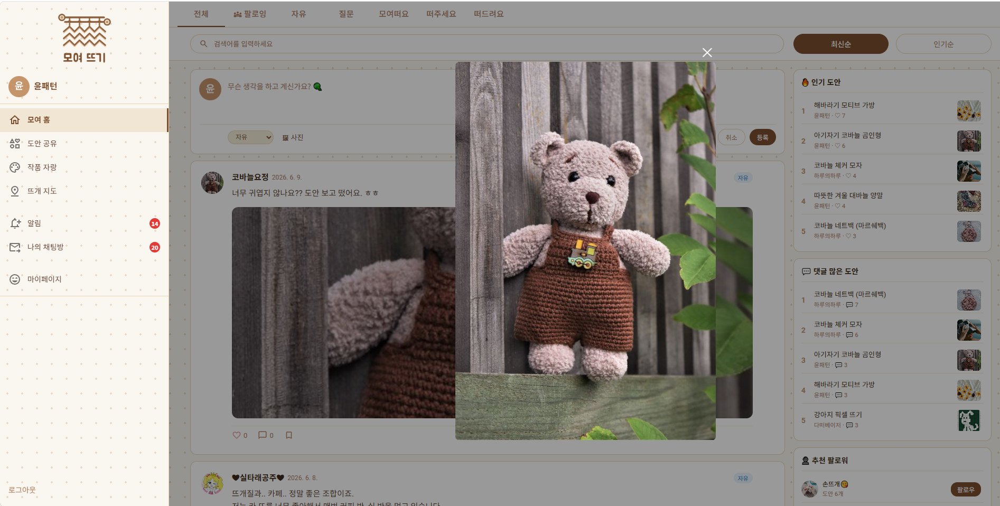
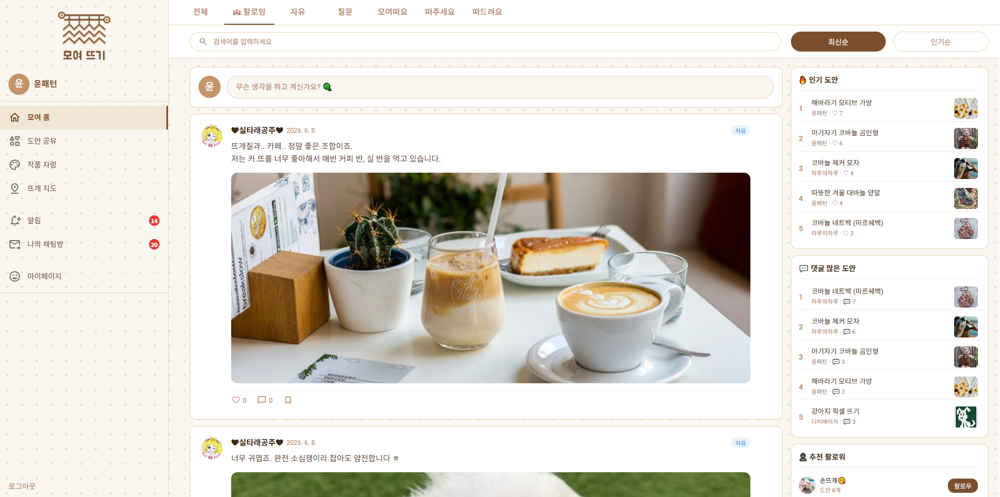

### 👤 유저 페이지 & 소셜
- 팔로우/팔로잉, 맞팔로우 뱃지
- 내 도안 / 게시글 / 스크랩 탭
- 활동 통계 위젯
- 1:1 DM 채팅
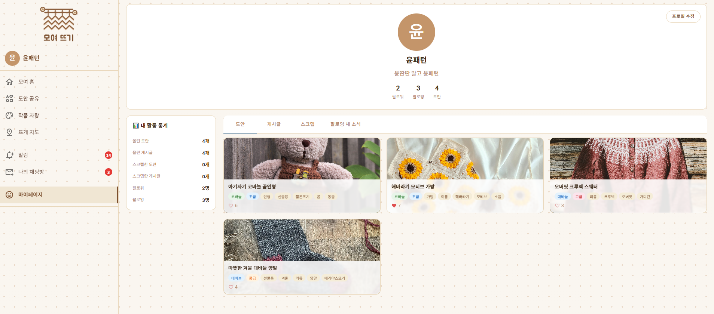
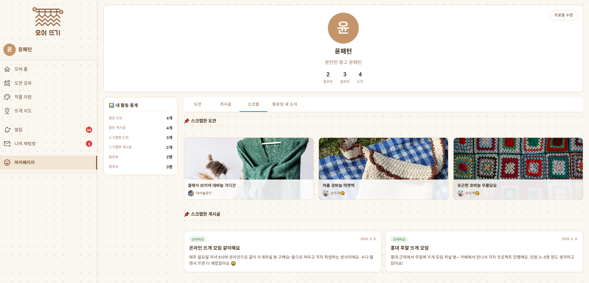
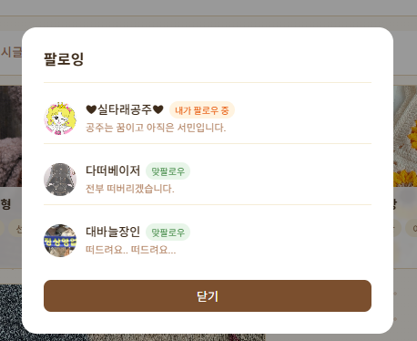

### 💬 채팅
- 모여떠요 게시글 연동 그룹 채팅방
- 1:1 DM 채팅방
- 실시간 메시지 (폴링 방식)
- 미읽음 뱃지

### 🔔 알림
- 댓글 / 좋아요 / 팔로우 / 채팅 알림 자동 생성
- 읽음 처리, 미읽음 뱃지

### 🔐 계정 관리
- 회원가입 / 로그인 (JWT)
- 아이디 찾기 / 비밀번호 찾기
- 비밀번호 변경 / 회원탈퇴

 

## 👩‍🏫 PPT

 

##  🎥 핵심 기능 시연 영상

 

## 📁 프로젝트 자료 모음

| 자료 | 링크 |
|---|---|
| 기획안 | [📄 보러가기](https://docs.google.com/document/d/1uUzlr1O2RTweepcOEuaI_CRB6hByuy__KoWPzYMHgrs/edit?usp=sharing) |
| 피그마 화면 설계 | [🎨 보러가기](https://docs.google.com/document/d/1TiLmH4lLxcMoRYwT1ziyueAlWBZcy3i9h3piQTgQcbU/edit?usp=sharing) |

 

---
> 2026 © 안혜진 — React 개인 프로젝트
